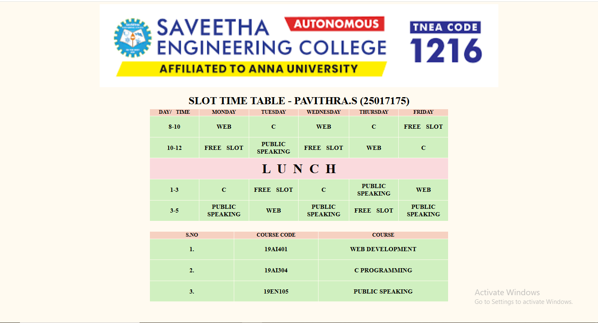

# Ex03 Time Table
# Date: 26/09/2025
# AIM
To write a html webpage page to display your slot timetable.

# ALGORITHM
## STEP 1
Create a Django-admin Interface.

## STEP 2
Create a static folder and inert HTML code.

## STEP 3
Create a simple table using `<table>` tag in html.

## STEP 4
Add header row using `<th>` tag.

## STEP 5
Add your timetable using `<td>` tag.

## STEP 6
Execute the program using runserver command.

# PROGRAM 
```
<!DOCTYPE html>
<html lang="en">
<head>
    <meta charset="UTF-8">
    <meta name="viewport" content="width=device-width, initial-scale=1.0">
    <title> </title>
    <style>
        table{
            margin: auto;
            width: 900px;
            font-weight: bolder;
            
        } td{
            background-color:#D0F0C0;
            width: 20px;
            height: 60px;
            font-size: larger;
            text-align: center;
        }
          
          th{
            background-color:#F6D1C1;
            width:100px;
            border: 50px;
            text-align: center;
        
          } h1{
           text-align: center;
             margin-bottom: 5px;}
           
           
          
          .table1 {
            margin-bottom: 30px;
            word-spacing: 10px;

           
          }
          .table2{
            margin-top: 10px;
           
          
          }
          p{
            margin-top: 10px;
            color: black;
          }
          h2{
            margin-bottom: 10px;
          }
          h4{
            text-align: center;
          }
          img{
            display: block;
            width: 1200px;
            height: 250px;
            margin: auto;
          }

          
          </style>
      
</head>
<body style="background-color:#FFFAF0;">
   
  

   <H1> SLOT TIME TABLE - PAVITHRA.S (25017175)</H1>
         <TABLE class = "table1"> 
       <TR> 
        <TH> DAY/ TIME  <TH>  MONDAY</TH> <TH> TUESDAY</TH> <TH> WEDNESDAY</TH><TH> THURSDAY</TH><TH>FRIDAY</TH>
    </TR> 
    <TR> 
        <TD>
         8-10  <TD> WEB </TD> <TD> C </TD> <TD> WEB </TD> <TD> C  </TD> <TD> FREE SLOT</TD>
        </TD>
    </TR>
    <TR> 
    <TD>10-12</TD> <TD> FREE SLOT</TD> <TD> PUBLIC SPEAKING</TD> <TD> FREE SLOT </TD> <TD> WEB </TD> <TD> C </TD>
    </TR> 
    <TR>
        <TD colspan="6" style="background-color:#FADADD; font-size: 40px;"> L  U  N  C  H </TD>
    </TR>
    <TR> 
        <TD> 1-3</TD> <TD> C </TD> <TD> FREE SLOT</TD> <TD> C  </TD> <TD> PUBLIC SPEAKING </TD><TD> WEB </TD>
    </TR>
    <TR> 
        
        <TD>3-5</TD> <TD> PUBLIC SPEAKING </TD> <TD> WEB </TD> <TD> PUBLIC SPEAKING</TD> <TD> FREE SLOT</TD> <TD> PUBLIC SPEAKING</TD>
        
    </TR>
    </TABLE>
  <TABLE class="table2">
    <TR> 
       <TH>  S.NO </TH> <TH>  COURSE CODE</TH> <TH> COURSE</TH>
    </TR>
    <TR> 
        <TD>  1.</TD> <TD> 19AI401</TD> <TD> WEB DEVELOPMENT</TD>
    </TR>
    <TR> 
        <TD> 2.</TD> <TD> 19AI304</TD> <TD> C PROGRAMMING </TD>
    </TR> 
    <TR> 
        <TD> 3.</TD> <TD> 19EN105</TD> <TD> PUBLIC SPEAKING </TD>
    </TR>
</TABLE >
</html>
```
# OUTPUT 

# RESULT
The program for creating slot timetable using basic HTML tags is executed successfully.
